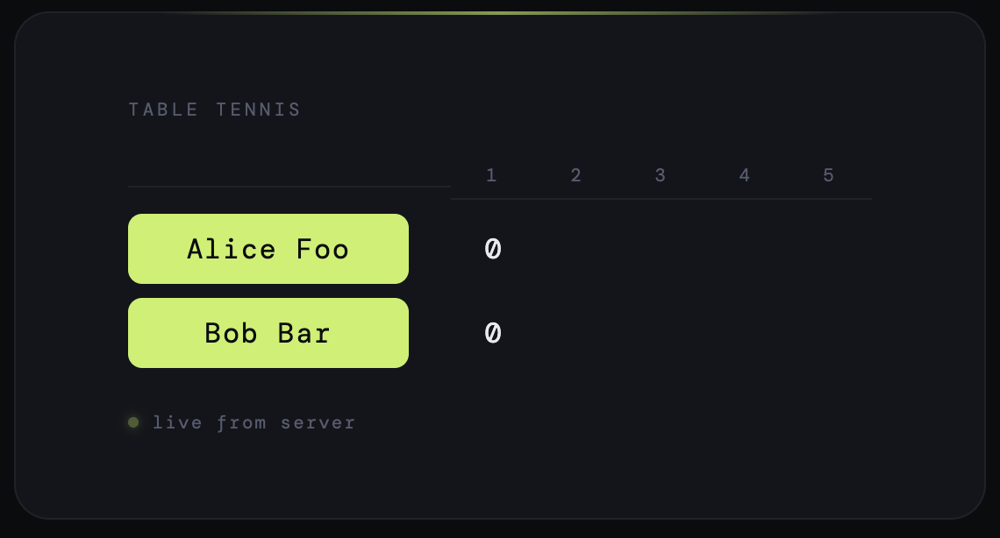
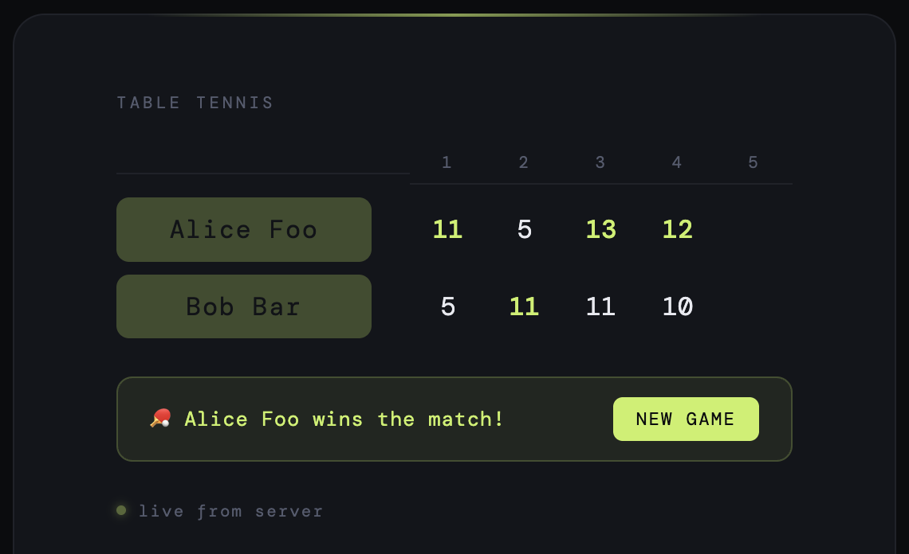
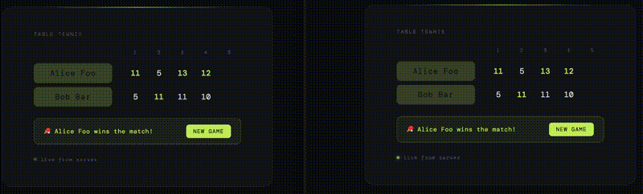

# ping

This project is a basic client-server application that keeps track of the score of a table tennis game. It uses Vue 3 and Typescript.

Your objective is to implement some [feature requests](#feature-requests) to improve it.


## Quick start

### 1. Install dependencies

```
npm run install
```

### 2. Run the unit tests

```
npm run test
```

### 3. Start the server and the client

You need to start the server with the names of the players and the maximum number of sets in the game.
Here is how to start a "best of 5 sets" game: 

```
npm start -- "Alice Foo" "Bob Bar" 5
```

Then, you need to open http://localhost:3000 in a browser:



## How it works

Click on the player names to update the score.

A set is won when a player reaches 11 with a 2 points lead.

A game is won when a player has won more than half the sets (i.e. for a best of 5 game, you need 3 sets to win):




## Architecture

The web client sends updates to the server via websocket messages to tell which player has scored a point.

The server pushes updates to the clients sending a state object in JSON form via websocket messages.

Multiple clients can be connected to the same server:




## Feature requests

Implement as many features as you can in the order you want.

Make sure to refactor the code as needed to avoid spaghetti code.

Make sure to add/update unit tests when relevant/necessary. 


### 1. Add serving indicator
The service rotation rules are the following:

- the serve alternates between players after every 2 points

- if the score reaches 10-10 in a set, the players alternate on each point until the end of the set

- the first player to serve in the first set will be the one specified first on the start command. The second player will begin
to serve in the second set. The first player will begin to serve in the third set, etc

The task is to add a visual indicator next to the name of the player that should serve next, like for instance:

```
                1   2   3   4   5
Alice Foo *     4  
Bob Bar         1
```


### 2. Add game/match points indicator

When a player is in a position to win a set, we want to display "Game point" like for instance:

```
Game point      1   2   3   4   5
Alice Foo *    10  
Bob Bar         1
```

If their opponent wins the point but they have another game point, we want an indication of
how many points have been played:

```
Game point #2   1   2   3   4   5
Alice Foo *    10  
Bob Bar         2
```

Note that if the opponent keeps winning points until they have game points of their own, we want
to see the counter adjusted to their number of game points. For instance, if the score is:

```
Game point #9   1   2   3   4   5
Alice Foo *    10  
Bob Bar         9
````

and Bob Bar scores the next 2 points, we should see:

```
Game point      1   2   3   4   5
Alice Foo      10  
Bob Bar   *    11
````

because that would be the first game point for him.

If a player is in a position to win the whole game, the indicator should say "Match point" instead:

```
Match point     1   2   3   4   5
Alice Foo       0   0   0  
Bob Bar   *    11  11  10
````


### 3. Add support for yellow/red cards
If a player commits an offense, the referee gives them a yellow card.
If they commit a second offense, the referee awards one point to their opponent.
If they commit a third offense, the referee awards two points to their opponent.
If they commit a fourth offense, they lose the game.

If a player needs only one point to win the match and their opponent commits a third offense worth 2 penalty points, the score is just updated by the one
point needed to finish the game.

However, if the player only needs one point to win the current set, the second penalty point will be reported to the next set.

The task is to add buttons to report offenses and update the score and the scoreboard accordingly.
After the first offense, we want to show a yellow marker next to a player's name.
After the second offense, we want to show a yellow marker and a red marker.


### 4. Add support for timeout indicators
Each player can use one timeout during a game.

The task is to add buttons to report when a player uses their timeout and to show some marker when a player
has used their timeout.


### 5. Display serve statistics
We want to keep track of how many points each player has won on their own serve, like for instance:

```
Game point #9   1   2   3   4   5       Points won on serve
Alice Foo *    10                       47.5% 
Bob Bar         9                       58.1%
````


### 6. Add undo/redo buttons
We want to be able to undo/redo the last modification.
Make sure to update all the data (serving indicator, offenses, statistics, ...).


### 7. Add an http endpoint to get the data
We want to have a GET endpoint to be able to fetch the whole game state as JSON like this:

```
$ curl http://localhost:3000/data
{
  .... your json data
}
```


### 8. Admin mode
Change the logic so that only one web client at a time can update the scores.


### 9. No default values
Instead of using default values when the program is not started with all 3 arguments,
use the `inquirer` npm package to ask for the missing information.

For instance, if we start the program with `npm run start -- "Alice Foo"`, the program
should ask for the name of the second player and the number of sets.


### 10. Add persistence
We want to persist the current game on disk on every modification done before the match is over,
so that if the server is killed with Ctrl+C, we can resume the current game when restarting the server.
If there is a persisted game, the server should allow starting without asking for any argument.

Bonus point if the ability to undo/redo survives a restart.
